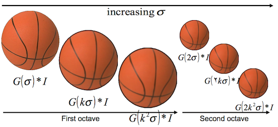
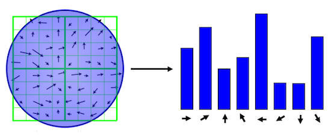
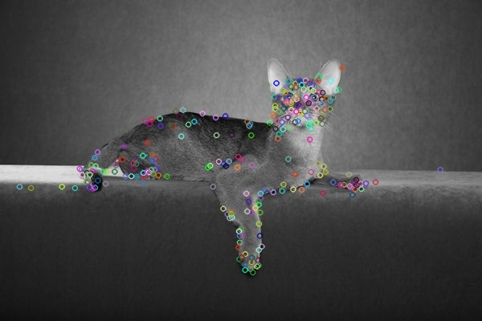

<script type="text/javascript"
   src="http://cdn.mathjax.org/mathjax/latest/MathJax.js?config=TeX-AMS-MML_HTMLorMML">
</script>
# Advanced Image Analysis
Chengliang Tang, Yuting Ma

Applied Data Science (2017 Spring)


## Scale Invariant Feature Transformation (SIFT)

* Scale Invariant Feature Transformation (SIFT) was introduced by D.Lowe, University of British Columbia,in 2004. It is currently one of the most commonly used feature detector and descriptor for image analysis. It operates in 4 parts:
	- Detector
		1. Find Scale-Space Extrema
		2. Keypoint Localization & Filtering
			+ Improve keypoints and throw out bad ones
	- Descriptor
		1. Orientation Assignment
			+ Remove effects of rotation and scale
		2. Create descriptor
			+ Using histograms of orientations

### Feature Detection

#### Scale-Space Extrema Detection
1. Construct a scale space
	* Increase in octave in a number of scale levels

    * Example

2. Image is convolved with Gaussian filters at different scales
   - Under a variety of reasonable assumptions, the only possible scale-space kernel is the Gaussian function.
	-  is the convolution of the original image with Guassian blur  --> 	
3. The difference of successive Gaussian-blurred images are taken --> Difference of Gaussian (DoG) 

 * = difference at different scales $k_i$ and $k_j$


4.  Keypoints are then taken as **maxima/minima** of the Difference of Gaussians (DoG) that occur at multiple scales.


* Parameter to tune:
	- Number of octaves
	- Number of scale levels
	- Initial $\sigma$
	- Initial $k$

#### Keypoint Localization
* Scale-space extrema detection results in too many keypoints, some of which are unstable. 
* Keypoint localization used Taylor series expansion of scale space to get more accurate location of extrema
	- It removes detected keypoints with intensity lower than a **contrastThreshold**
	- It removes detected keypoints that are consider to be at the edges.
		+ It uses a 2x2 Hessian matrix (H) to compute the pricipal curvature. If a ratio between the squared trace and the determinant is less than a **edgeThreshold**, the keypoint is discarded. 
* Parameters:
	- contrast Threshold
	- edge Threshold

### Feature Description
After getting a set of "good" keypoints, we need to quantify the characteristics of the local image patch. 

#### Orientation Assignment
* An orientation is assigned to each keypoint to achieve invariance to image rotation.

* A neigbourhood is taken around the keypoint location depending on the scale, and the gradient magnitude and direction is calculated in that region. 

(Computation details, see reference.)
* An orientation histogram with 36 bins covering 360 degrees is created
	- It is weighted by gradient magnitude and gaussian-weighted circular window with $\sigma$ equal to 1.5 times the scale of keypoint. 
* The highest peak in the histogram is taken and any peak above 80% of it is also considered to calculate the orientation. It creates keypoints with same location and scale, but different directions. So, orientation can split up one keypoint into multiple keypoints.



* It contribute to stability of matching.


#### Keypoint Descriptor

SIFT descriptor is a 128-dimenional vector, derived by:

1. a 16x16 window around the keypoint. This 16x16 window is broken into sixteen 4x4 windows. 

2. Within each 4x4 window, gradient magnitudes and orientations are calculated. These orientations are put into an 8 bin histogram. 
3. Doing this for all 16 windows, you would've "compiled" 16 totally random orientations into 8 predetermined bins. Once you have all 16*8 = 128 numbers, you normalize them into "feature vector"


## Use OpenCV-Python for Image Analysis

### Use OpenCV-Python From R 
#### Installation
* Install Python
* Install OpenCV for Python
	- [A Guide of install OpenCV 3.0 and Python 2.7+ on OSX](http://www.pyimagesearch.com/2015/06/15/install-opencv-3-0-and-python-2-7-on-osx/)
	- It is recommended that OpenCV is installed in a virtualenv
* Install R package "rPython"


#### How to Use
1. Open terminal, activate (work on) the virtualenv created with OpenCV by `source myvirtualenv/bin/activate` or `workon myvirtualenv`.

2. Run R in the virtualenv and `library(rPython)`
3. Write a sample Python code with `import cv2` to see if the module can be successfully imported. For instance: 

```
# test.py
import numpy as np
import cv2
img = cv2.imread('cat.jpg')
d = img.shape
```
4.Try to call test.py from R and load variables from Python to R.

```
> library(rPython)
> #Load/run the main Python script
> python.load("test.py")
> # Get the variable from python
> python.load("test.py")
> d <- python.get("d")
> d
[1] 400 600   3
```
* Note that the object loaded from Python to R need to be **JSON serializable**. JSON is a format that encodes objects in a string. Serialization means to convert an object into that string, and deserialization is its inverse operation. When transmitting data or storing them in a file, the data are required to be byte strings, but complex objects are seldom in this format. 
* The most commonly used data structure in Python is `ndarray` from numpy, which is analogous to n-dimensional array in R. However, `ndarray` is not JSON serializable so it cannot be directly loaded to R. To overcome this issue, you can convert `ndarray` to `list` in your Python script. For instance: by adding `x_list = x.tolist()` where `x` is a `ndarray`, it will be read as an list in R. 

#### Potential Problem and Solution
* If you have different version of python
    - From terminal (before open R), eg.: `export RPYTHON_PYTHON_VERSION=2.7.11`
    - always check your `Sys.getenv()` in R.
* When installing OpenCV, after step 7 you may need to restart the system to reconfigure the `.bash_profile` before proceeding to step 8.
* You need to have opencv libraries ready for R to use. So if runs into library error, you may need to copy opencv DYLD libraries to R library: `cp -R ~/opencv/build/lib /Library/Frameworks/R.framework/Resources/lib`
* Unfortunately, I haven't figured out how to configure RStudio to the python virtualenv. RStudio links to the system Python path by default. Hope you can help me with it. 
* Unfortunately too, rPython is currently not available for Windows OS.
	- Solution:
    	- Use some virtual machines like VMware or VirtualBox on windows and install Linux and carry out your work
    	- Call python from R through Rcpp, which basically connect R and python via C++
    	- Directly use python and use intermediate outputs to facilitate the data analysis.
        	- http://gallery.rcpp.org/articles/rcpp-python/
        	- Cons: lack of interactivity


### Use SIFT in OpenCV

```
# test_sift.py
import numpy as np
import cv2
img = cv2.imread('cat.jpg')
gray= cv2.cvtColor(img,cv2.COLOR_BGR2GRAY)
sift = cv2.xfeatures2d.SIFT_create()
(kps, descs) = sift.detectAndCompute(gray, None)
print("# kps: {}, descriptors: {}".format(len(kps), descs.shape))
img=cv2.drawKeypoints(gray,kps, img)
cv2.imwrite('sift_keypoints.jpg',img)
descs_list = descs.tolist()
```
* The output image with key points detected


In R:

```
> python.load("test_sift.py")
> descs_list <- python.get("descs_list")
> # Convert list to array
> img_descs <- do.call()
> length(img_descs)
[1] 305
> img_sift <- do.call("rbind", img_descs)
> dim(img_sift)
[1] 305 128
> img_sift[1:5, 1:5]
     [,1] [,2] [,3] [,4] [,5]
[1,]   56   10    8   13   16
[2,]    3   29   26   35   15
[3,]    0    0    2   36   83
[4,]   71   42    6    1    2
[5,]    0    0    1   16  115
```

### Other Methods in OpenCv
#### Harris Corner Detection
```
# test_corner.py
import cv2
import numpy as np
filename = 'cat.jpg'
img = cv2.imread(filename)
gray = cv2.cvtColor(img,cv2.COLOR_BGR2GRAY)
gray = np.float32(gray)
dst = cv2.cornerHarris(gray,2,3,0.04)
#result is dilated for marking the corners, not important
dst = cv2.dilate(dst,None)
# Threshold for an optimal value, it may vary depending on the image.
img[dst>0.01*dst.max()]=[0,0,255]
cv2.imshow('dst',img)
if cv2.waitKey(0) & 0xff == 27:
    cv2.destroyAllWindows()
```
The detected points are:


And a lot more to be explored. 

## Use Matlab For Image Analysis

### Use SIFT in Matlab

SIFT and other advanced image analysis tools are available in Matlab from library [VlFeat](http://www.vlfeat.org/). The [sample code](http://www.vlfeat.org/applications/caltech-101-code.html) of implementing SIFT in matlab is also avaiable.


### Other Methods 

In addition to the ordinary SIFT, VlFeat also offers some other useful tools for feature extraction and description, which might be more efficient computationally. For instance:

* [MSER feature detector](http://www.vlfeat.org/overview/mser.html)       
* [Dense SIFT](http://www.vlfeat.org/api/dsift.html)
* [HOG features](http://www.vlfeat.org/overview/hog.html)
        	        	
## Bag-of-Words (BoW) Model
* In natural language processing, a text corpus, such as a sentence or a document, is represented as an unordered "bag" of individual words, regardless of grammar and word ordering.
* The bag-of-words model is commonly used in methods of document classification, where the (frequency of) occurrence of each word is used as a feature for training a classifier.


### Visual Bag-of-Words Representation
* An image can be treated as a document
* Local features extracted from the images are considered as the "visual words"
* An image can be represented as an unordered collection of visual words, such as histogram. 


### Pipeline
* Feature extraction (SIFT)
 - Feature Detection
 - Feature Description
* Visual vocabulary (codebook) construction
* Image representation based on learned vocabulary
* Learning and Recognition


## References
* [OpenCV 3.0 official doumentation](http://docs.opencv.org/3.0-beta/doc/py_tutorials/py_tutorials.html)
* [A Nice SIFT Tutorial](http://www.inf.fu-berlin.de/lehre/SS09/CV/uebungen/uebung09/SIFT.pdf)
* [VlFeat](http://www.vlfeat.org/index.html)
